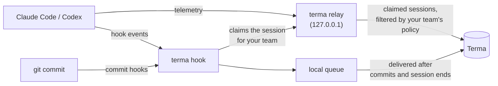

<p align="center">
  <picture>
    <source media="(prefers-color-scheme: dark)" srcset="docs/assets/terma-logo-dark.svg">
    
  </picture>
</p>

The `terma` cli connects coding agents to [Terma](https://terma.ai), then stamps the commits
they produce so agent spend can be traced to shipped code. It supports **Claude Code**
(CLI and Desktop) and **Codex** (CLI and Desktop).

## Get started

Install terma one of these ways, then run `terma setup` once.

**Installer script** (macOS and Linux). Installs to `~/.local/bin`, without sudo, and
verifies `checksums.txt`. terma keeps it up to date by itself (see [Updates](#updates)).

```bash
curl -fsSL https://terma.ai/install.sh | bash
terma setup
```

**Homebrew** (macOS and Linux). It updates with `brew upgrade terma`; `terma update` runs
that through the Homebrew that owns this terma.

```bash
brew tap miradorlabs/tap
brew trust miradorlabs/tap     # once; Homebrew will not load an untrusted tap
brew install terma
terma setup
```

**npm**. It updates with `npm install -g @miradorlabs/terma@latest`; `terma update` runs
that through the npm that owns this terma. The npm shim adds Node's startup time to every commit, so prefer the
installer script or Homebrew where terma runs inside git hooks.

```bash
npm install -g @miradorlabs/terma
terma setup
```

**Direct download or source**. Binaries are on
[Releases](https://github.com/miradorlabs/terma-cli/releases), with checksums; on macOS and
Linux, terma keeps a downloaded release up to date by itself. From a clone of this
repository, `make install` builds terma; a build between release tags is never updated
until `terma update --force` replaces it with the latest release. On Windows, download each
new release from Releases: terma does not update in place there yet.

```bash
make install
terma setup
```

The installer script takes `TERMA_INSTALL_DIR` to change the destination and
`TERMA_VERSION=vX.Y.Z` to pin a release. It is POSIX `sh`, so `| sh` works too.

`terma setup` signs you in through your browser, then asks:

1. **Organization**, when you belong to several.
2. **Coding agents**: the ones installed on this machine are preselected.
3. **Team**, the first time, when your organization has several.

It then points your agents at terma's local relay and writes their machine-wide hooks.
Restart any agent that was already running so it loads the new configuration, then check
the result:

```bash
terma doctor
```

## How it works



Your team's collection policy, set in the Terma web app, lists the repositories it
collects. A hook that runs in one of them claims the session for your team; the relay
forwards only claimed sessions, and only the content the policy collects. Everything else,
personal work and other repositories included, never leaves your machine. When the policy
asks for commit stamping, a commit of files an agent session edited gets an
`Agent-Session-Id` trailer.

## Commands

Every command is safe to run again:

```bash
terma setup       # sign in, choose your organization, agents and team, write machine-wide hooks
terma doctor      # show what this machine collects and check the chain end to end
terma update      # install the latest release, or refresh what terma installed
terma teardown    # undo setup on this machine (--sign-out also signs out)
```

Run `terma setup` again to repair the machine or to switch organization; it reuses a
working sign-in and the team you chose. `terma doctor` opens with what this machine
collects and what the repository has in progress (the active session, uncommitted agent
edits), then checks every link: sign-in, whether the team collects this repository (and
the origin terma sees), the hooks, the agents' export, the queue, and delivery. Every
failure names its fix.

Hidden commands remain for the programs that run them — hook execution, the local
relay, spool delivery, shell completion — and for Terma's own engineers.

## Updates

terma keeps itself up to date. Once a day it looks for a new release (every 15 minutes
while the lookup is failing) and installs it in place, verified against the release
checksum. The local relay does this in the background, so a machine nobody runs a terma
command on still updates, and so does each terma command you run in a terminal. Hooks,
scripts, CI and `--output` other than a table never look. A relay that installed a
release keeps running until nothing it holds is waiting and no agent has exported for
half a minute, then restarts on the new binary, so the restart loses nothing.

A patch release (1.4.2 → 1.4.3) installs as soon as it is found. A new minor or major
version (1.4 → 1.5, 1 → 2) installs once it has been out for 24 hours, so one that breaks
can be pulled before it reaches every machine. `terma update` never waits.

```bash
terma update --check        # check without installing
terma update                # install the latest release, or refresh what terma installed
terma update --auto off     # only say when one is out
terma update --auto on      # install new releases automatically again (the default)
terma update --auto status  # show the current choice
```

terma never replaces a Homebrew or npm installation or a Windows binary by itself; those
only get the notice, and `terma setup` says which applies to yours. `terma update`
upgrades Homebrew and npm through the package manager that owns them, and when it cannot
find that package manager it names the command to run; a Windows binary is replaced by
hand, as Get started says. A build between release tags is never updated and gets no
notice.

**A bad release.** terma never installs an older version over a newer one, so a release
is rolled back by rolling forward: delete the bad release, or mark it a pre-release, so
GitHub's latest release is the previous one again and machines that have not taken it
never will, then publish a fixed patch release, which every machine installs at its next
daily check. Pull a bad minor or major release within its 24 hours and no machine
installs it automatically.

After an update, the new version also refreshes what earlier versions wrote in your home
directory — the wrapped Claude Code status line, the OpenCode plugin, the relay's service —
keeping every choice you made. It works from what is on disk, never signs in, and never
adds a file. After an update the relay installed, it runs at your next terma command. On
the latest release, `terma update` does just that refresh.

## Scripted and headless setup

Every question `terma setup` asks has a flag:

```bash
terma setup --org acme --team platform --harness claude,codex --yes
```

- `--org <name-or-id>` signs in to that organization. Without it, setup asks when you
  belong to several, or, when it cannot ask, keeps the current one and says so.
- `--team <name-or-id>` sets up that team; without it, setup keeps the team you chose
  before, else your organization's only team, else asks.
- `--harness <agents>` records those agents (`claude`, `codex`); with `--yes` or no
  terminal and no `--harness`, setup records the agents recorded before and every
  supported agent installed on this machine.
- `--yes` skips the browser prompt and the organization and agents questions. The team
  picker still asks the first time when your organization has several, so name it with
  `--team`.
- `--no-browser` prints the sign-in URL instead of opening a browser.
- `--relay-service off` starts the relay on demand from hooks instead of as a background
  service; `--relay-addr <host:port>` moves it off a loopback port another program holds.
- `--insecure-storage` saves credentials in plain text instead of the system keychain.
- `--managed-config <dir>` writes the machine-wide hooks as managed configuration for your
  organization to deploy, and exits; each developer still runs `terma setup` once.

Every other command reads the team you chose at setup; `--team <name-or-id>` overrides it
for one command.

## Collection

### Which repositories are collected

Your team's collection policy, set in the Terma web app, lists the repositories it
collects. A session or commit is collected only in a repository the list names;
everywhere else the hooks collect nothing. They leave only a local note that the session
is not collected (its id, the agent and its process ids; no team, project or
repository), so the relay drops its telemetry at once instead of holding it.

Each entry is a repository as `host/owner/name`, e.g. `github.com/miradorlabs/mirador-platform`.
The CLI admits a session only inside a git working copy whose `origin` remote, normalised,
equals an entry ignoring case: host lowercased without port or credentials, path with
`.git` and any trailing slash stripped, from scp (`git@host:path`), `https://`, `ssh://`
and `git://` forms. A linked worktree reads `origin` from its main repository. A folder
outside git, a repository with no `origin`, or an `origin` that is a local path or
`file://` URL is never admitted. An entry has a host and at least two path segments, none
empty; a longer path matches a longer `origin` path exactly (GitLab subgroups). An empty
list admits nothing.

So a clone in any folder, a subdirectory of it, and a worktree of it at
`.claude/worktrees/fix-1` are all collected by `github.com/acme/api` when origin is
`git@github.com:acme/api.git` or `https://github.com/acme/api`; a fork whose origin is
`github.com/you/api` is not. An SSH host alias (`git@github-work:acme/api` through
`~/.ssh/config`) normalises to host `github-work` and does not match
`github.com/acme/api`: point origin at the real host and choose the key with
`core.sshCommand`, as `terma doctor` shows. In global mode the policy collects every
session, inside git or not. Each session reports to the team of the developer who ran it,
so two developers on different teams in one repository each report to their own.

### Which commits are stamped

Commit stamping is the team policy's choice, off unless a team admin turns it on in the
Terma web app. Off, which work landed is inferred from the git commands
agents run; on, `post-commit` records every commit as it lands, including ones made
outside an agent, for commit-level accuracy. `terma setup` and `terma doctor` say so when
your team has it off. With it on, the first agent session claimed
in a repository the policy collects installs `prepare-commit-msg` and `post-commit` into
that repository's own `.git/hooks` (the common one, so linked worktrees share them). A
repository no agent has worked in, and a folder outside git, get nothing. If they are
already there, terma does nothing. It never takes them out: switching the policy off only
stops terma adding them anywhere new, and `terma teardown` leaves them too, since once
terma is gone they only run the hook each one displaced. `terma doctor` reports this
repository's state.

Only a commit of files a session edited is stamped: your own commit beside an open
session is yours. A merge, a squash, and the commits a rebase or cherry-pick replays are
never stamped.

### Hook managers

git runs exactly one file per hook name, so terma chains: a hook already in `.git/hooks`
is renamed to `<name>.pre-terma` and terma's script runs it first, unchanged. It keeps
its veto — if it exits non-zero the commit stops — and once terma is gone it still runs.

- **pre-commit** and **lefthook** install normally, into `.git/hooks`: terma sets no
  `core.hooksPath`, which is what both of them refuse to install under. If terma's
  hooks are already there, their install moves terma's script aside, and at the next
  agent session terma chains to theirs instead. terma deletes no hook it did not write:
  if a hook it set aside earlier is still at `<name>.pre-terma` and differs from theirs,
  terma leaves the repository alone, `terma doctor` says so, and the tool's chain keeps
  running that hook and terma's. One sequence fails loudly for a while: re-running
  `pre-commit install` over terma's script, when terma had chained pre-commit's, makes
  the two scripts call each other, and commits fail with pre-commit's own message until
  the next agent session in that repository puts terma's script back.
- **husky v9** sets the repository's own `core.hooksPath`, so git never reads
  `.git/hooks`. terma skips such a repository rather than overriding what it chose, and
  `terma doctor` reports that commits here are not stamped.


## Routing

Your agents export to a relay terma runs on your machine (on `127.0.0.1`), from their own
user-level settings — which is also what Claude Desktop, Codex Desktop and IDE extensions
read, so they are covered too. A machine-wide hook claims each session that runs in a
repository your team collects, for your team; the relay forwards only claimed sessions,
with your team's key. Everything else — personal work, other repositories, folders
outside git — never leaves your machine. A session in a repository the list does not
name, or outside git, is dropped as soon as its first hook runs; anything else unclaimed
waits briefly in memory, never on disk, then is dropped; a relay restart drops it too.
A session that moves to a repository the list does not name, or whose repository leaves
the list, stops being forwarded; one that moves into a listed repository is forwarded
from the move on, and what it sent before stays dropped.

What content leaves is your team's collection policy, set in the Terma web app, and nothing else.
The relay and the hook queue's delivery fetch it with your login; until they have,
nothing they would send leaves. Agents send prompts, model responses and tool input and
output to the relay, and the relay removes what the policy does not collect before
anything leaves. While it collects tool content, the relay also names the working tree a
session's hooks last ran in (`terma.repository.root`), which the agents' own records do not,
so Terma can tell which checkout a git command ran in; it is a local path, so it leaves with
tool content or not at all. Hook events, which queue on this machine and never pass the relay, are
held to the same policy when they are sent: an event queued before the policy tightened
leaves without the content it no longer collects, and one from a repository no longer
listed does not leave.

`terma setup` runs the relay as a per-user background service, so it is up before any
agent starts; with `--relay-service off`, hooks start it on demand. `terma update`
rewrites a service an earlier terma wrote. `terma doctor` shows whether it runs and
delivers; `terma teardown` stops it and removes its service.

## Hooks and commit attribution

Terma uses fast, local hooks. Each hook is a guarded one-liner that calls
terma by the full path it was written with; the binary owns the session files,
touched-file manifests, commit trailers, and local event spool. If terma is gone, the
hooks are silent and inert. `TERMA_HOOKS=0` turns the hooks off for one shell or
process. The commit hooks are installed per repository, so git in a repository no agent
has worked in runs nothing of terma's at all.

Commit attribution works like this:

1. Agent hooks announce sessions and record files the agent edits.
2. `prepare-commit-msg` intersects staged files with those manifests and adds one
   `Agent-Session-Id` / `Agent-Tool` trailer pair per matching session.
3. `post-commit` retires the committed files and records the commit event.

Hooks never make a network request. They append to a local queue, and delivery happens
after commits and session ends with retry and backoff. The prepare-commit-msg path is
tested against a sub-50 ms budget.


## Privacy and security

Authentication uses a browser handoff with PKCE and a loopback callback. Credentials and
team keys stay in the user's configuration directory (`~/.config/terma`, or
`%APPDATA%\terma` on Windows) with restrictive file permissions. What terma writes as it
runs — the event queue, the relay and its local token, the hooks' state, the record of the
repositories its commit hooks are installed in — stays in its state directory
(`~/.local/state/terma`, or `%LOCALAPPDATA%\terma` on Windows), with the same restrictive
permissions. The only thing terma writes inside a repository is its two commit hooks, under
`.git/hooks`, which git neither tracks nor carries in a commit; nothing reaches the working
tree or committed files. What content leaves is the team's collection policy alone, applied
on this machine before anything is sent.

## Architecture

terma is one binary with three roles:

- the **command line** (`internal/cli`), which `cmd/terma` starts;
- the **hooks** that coding agents and git run machine-wide (`terma hook <event>`,
  `internal/hooks`);
- a **local relay daemon** (`terma relay run`, `internal/relay`). It forwards an
  agent's own telemetry only for sessions a hook claimed in a repository the team
  collects.

Each coding agent is a plugin: one package under `internal/agents/<name>`, behind the
interfaces in `internal/agents`, and registered in `internal/agents/builtin`. Nothing
else names an agent, and `internal/boundary` tests that this holds.

## Documentation

- [Agent-facing CLI guide](https://terma.ai/cli/llms.txt)

## License

MIT — see [LICENSE](LICENSE).
